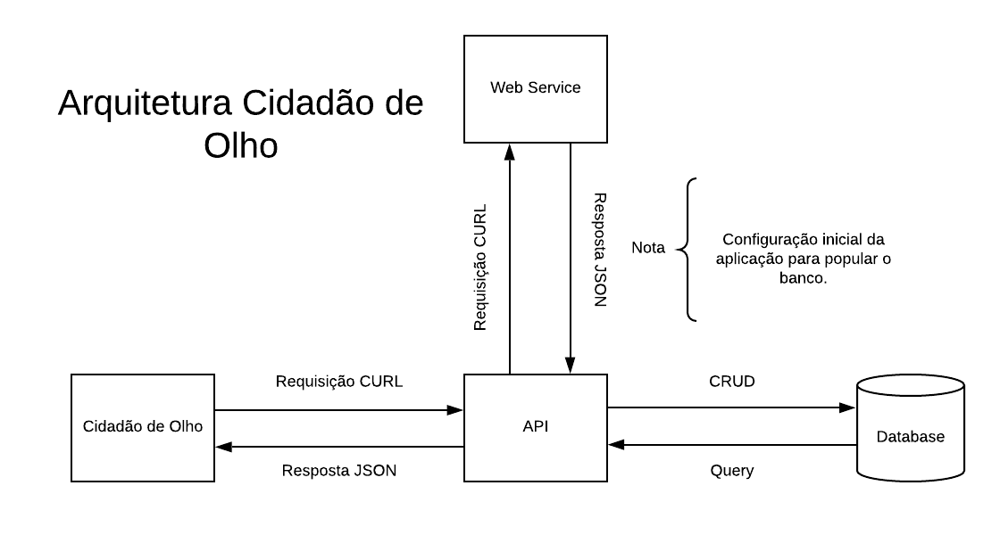

<h1>Cidadão de olho</h1>
# Sobre

A aplicação **Cidadão de olho** é uma ferramenta que facilita a transparência no governo do estado de Minas Gerais, utilizando somente dados abertos oferecidos pelo próprio governo, sendo eles:

- [Dados sobre os deputados em exercício](http://dadosabertos.almg.gov.br/ws/deputados/em_exercicio?formato=json).
- [Dados sobre cada deputado individualmente](http://dadosabertos.almg.gov.br/ws/deputados/ajuda#Registro%20de%20Deputado).
- [Dados sobre verbas indenizatórias de cada deputado](http://dadosabertos.almg.gov.br/ws/prestacao_contas/verbas_indenizatorias/ajuda#Lista%20de%20Datas%20de%20Verbas%20Indenizat%C3%B3rias%20de%20um%20Deputado%20na%20legislatura%20atual).

# Arquitetura

A aplicação é separada em dois módulos principais e dependentes entre si, portanto para utilizar a aplicação em sua totalidade é necessário instalar e configurar estes módulos, sendo ambos feitos em laravel e que tem seu funcionamento sintetizado na imagem a seguir.



### Cidadão de Olho

Neste módulo é onde ocorre a interação com usuários, sendo sua parte principal o front-end e conexão com a API. 
[Cidadão de Olho](https://github.com/MicaelBarreto/Cidadao-de-olho)

### Cidadão de Olho API

Neste módulo é onde ocorre a interação incial com o web service do governo de Minas Gerais, sendo sua parte principal o back-end e as regras de negócio. 
[Cidadão de Olho API](https://github.com/MicaelBarreto/Cidadao-de-olho-api)

# Instalação e configuração 

## Requisitos

Para instalar a aplicação será necessário:

- PHP 7.2.*
- Composer
- MySQL 5^

## Instalação

Após clonar o projeto você deverá utilizar os seguintes comandos:

Para instalar os pacotes do composer

```
composer install
```

## Configuração

As configurações necessárias para utilizar a aplicação são as seguintes:

- Copie o arquivo ***.env.example*** para ***.env***
```
cp .env.example .env
```
- Gerar a chave da aplicação
```
php artisan key:generate
```

## Utilizando a aplicação localmente

Para utilizar a aplicação em localhost basta rodar o seguinte comando no terminal

- Iniciar servidor php local
```
php artisan serve
```
